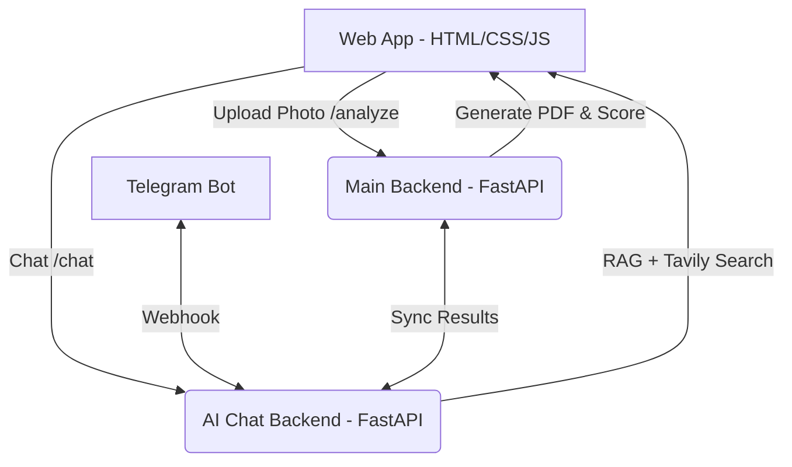

# 🧠 NeuroScan — AI-Powered Stroke Early-Warning Tool

NeuroScan is an end-to-end, AI-powered system designed to detect **facial movement asymmetry** (one of the primary signs of stroke under the clinical **FAST** protocol) using a simple webcam. It features a modern responsive web application, an ML-based analysis backend, and a conversational AI chat assistant integrated with a Telegram bot.

---

## 🏗️ Architecture Overview

The project is structured into three main components:



1. **Frontend (`webapp/`)**:
   - Responsive web interface with glassmorphism design and custom styling.
   - **Photo Scan**: Captures camera frames, detects facial asymmetry, displays risk gauges, and downloads PDF reports.
   - **AI Chat**: Multi-turn conversational assistant with web search.
   - **Research Hub**: Displays EDA charts, dataset details, ML evaluation metrics, and feature importance.

2. **Main Backend (`backend/`)**:
   - FastAPI app hosting the Machine Learning model (`stroke_model.pkl`, `stroke_scaler.pkl`).
   - Pre-processes face images, calculates facial landmark asymmetry percentages, and predicts stroke risk levels.
   - Generates and serves professional PDF reports.
   - Deployed on **Hugging Face Spaces**: `https://itzratul-neuroscan-backend.hf.space`

3. **AI Chat & Bot Backend (`chat_backend/`)**:
   - FastAPI app implementing conversational memory with **Groq LLaMA-3.3** (rotated API keys).
   - Ingests localized medical knowledge bases (prevention, symptoms, treatment, emergency) into a lightweight vector store for RAG.
   - Performs real-time web search via **Tavily** for up-to-date queries.
   - Integrates with **Telegram Bot API** via webhooks.
   - Runs locally with a **Pinggy SSH Tunnel** to bypass Hugging Face's outbound request limits to `api.telegram.org`.

---

## 🚀 Deployment & Local Run Instructions

### 1. Main Backend (Hugging Face Space)
The face analysis service is hosted on Hugging Face.
- **Hosted Link:** `https://itzratul-neuroscan-backend.hf.space/health`
- **To Deploy/Sync Changes:**
  Ensure you have your Hugging Face credentials ready, then run the deployment helper:
  ```bash
  python3 deploy_to_hf.py backend
  ```

### 2. Frontend Web App (Vercel)
The client frontend is hosted on Vercel.
- **Config file:** `webapp/vercel.json`
- **To Deploy:**
  1. Open your terminal in the `webapp/` folder.
  2. Install Vercel CLI: `npm install -g vercel`
  3. Deploy: `vercel --prod`

### 3. Telegram Bot & Chat Backend (Local Run)
Because Hugging Face restricts outgoing connections to Telegram's servers, the Telegram Bot is run on a local machine using a secure tunnel.

#### Configuration:
Create or edit `chat_backend/.env`:
```env
TAVILY_API_KEY="your-tavily-api-key"
TELEGRAM_BOT_TOKEN="your-telegram-bot-token"
MAIN_BACKEND_URL="https://itzratul-neuroscan-backend.hf.space"

# Groq API Keys (Supports key rotation - add as many as needed)
GROQ_API_KEY="gsk_..."
GROQ_API_KEY_2="gsk_..."
```

#### Running the Bot:
A utility script manages the FastAPI server, starts the secure Pinggy tunnel, and registers the webhook automatically:
```bash
# Start the bot backend and tunnel (runs as a background daemon)
nohup python3 -u scratch/run_local_chat.py > scratch/run_local_chat_daemon.log 2>&1 &
```
- **Monitor logs:**
  - Uvicorn/App logs: `tail -f scratch/local_chat.log`
  - Tunnel/Webhook logs: `tail -f scratch/run_local_chat_daemon.log`

---

## 📊 Research & Machine Learning Model
The ML models analyze asymmetry by measuring landmark Euclidean distances across the sagittal plane. Detailed performance, correlations, and dataset features are available in the **Research** section of the webapp (`webapp/research.html`).
- **Feature Evaluated:** Face landmarker ratios, eye, eyebrow, and lip movement/deviation.
- **Evaluation Assets:** Visualizations are saved in `webapp/assets/` representing confusion matrices, ROC curves, and EDA plots.

---

## 🛠️ GitHub Clean-Slate Push Guide

To push this exact local version of the code to GitHub and overwrite the old version entirely (replacing history or starting clean):

1. **Stage all changes** (adds new files, removes deleted files):
   ```bash
   git add -A
   ```
2. **Commit the changes:**
   ```bash
   git commit -m "feat: complete rewrite - NeuroScan V2"
   ```
3. **Push to GitHub (Force Overwrite):**
   ```bash
   git push --force origin main
   ```
   *(Change `main` to `master` if that is your remote default branch name).*
